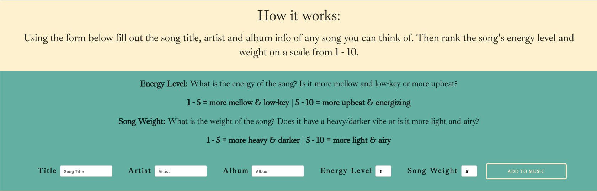
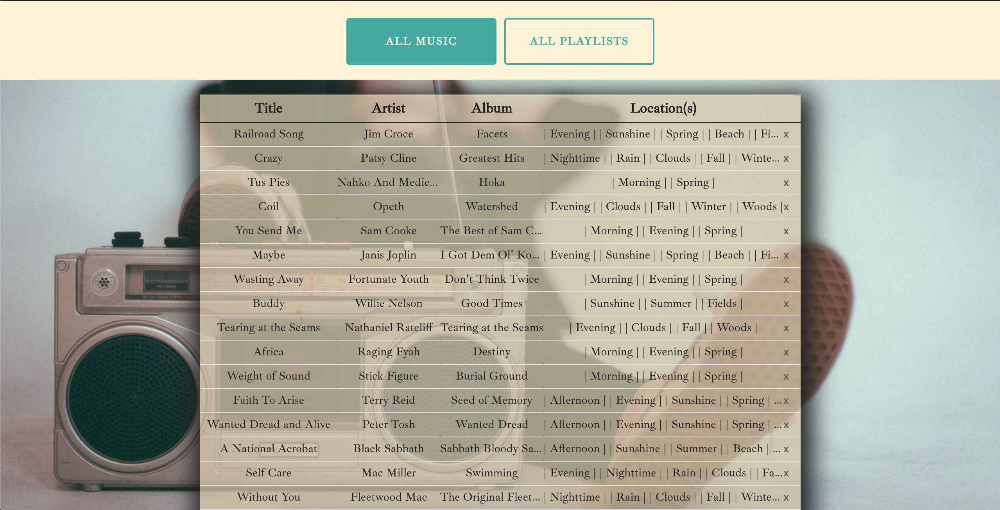
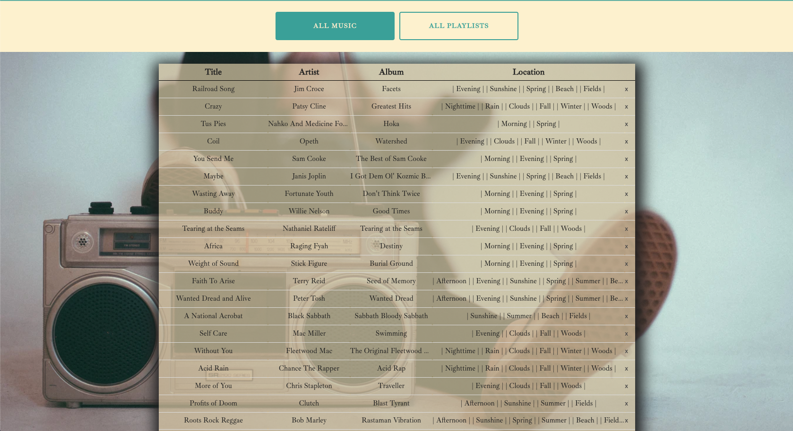

# [Life's Music](https://mern-music.herokuapp.com/)

##### Tech Used:
HTML / CSS / Skeleton CSS / JavaScript / MongoDB/Mongoose / Express / React / Node.js

## About the App
As an avid music listener I make playlists for just about every occasion and am VERY particular to what music fits in certain instances such as the time of day, the weather outside and the time of year. Understanding that it becomes tiresome manually updating playlists, I wanted to implement a sort of 'algorithm' that helped generate and update these playlists automatically.

## Navigating the App
Using this app is really simple since it is designed to do things automatically. Users simply have to input a song with the title, artist and album. They then rate the song's energy level and weight on a scale from 1 to 10 (1-5 being more mellow/low-key and heavier/darker and 5-10 being more upbeat/energizing and light/airy).

Once the song is submitted it gets added to the main library (as well as the playlists that fits the song's ratings) where users can see the song's title, artist, album and playlist location(s).

Users can then click 'All Playlists' button to view all playlists and click on any specific playlist to see which songs populate it.

If a user decides to change the rating of a song after it has been inputted they simply click the song they want to edit and re-rate it accordingly. This will then update the main library as well as the song's location(s) based on its new rating and will render in the playlist(s) it now belongs to.

## Behind the Scenes

### Sorting Function

### Updating Data

### Beginning

### Middle

### End

## Recap
There were plenty of ideas originally planned that were thwarted so figuring out a solution when I ran into problems came to be the story of this app. There are plenty of things I wish I could've done with this app but due to the obstacles faced at the beginning I wasn't able to build it out the way I originally planned. I plan on implementing a few more features such as authentication, sorting by title, artist or album and being able to click on a playlist from the main library and having that playlist pop up. The list goes on and on but I am excited to continue working on this project and making it exactly as I had originally planned.
